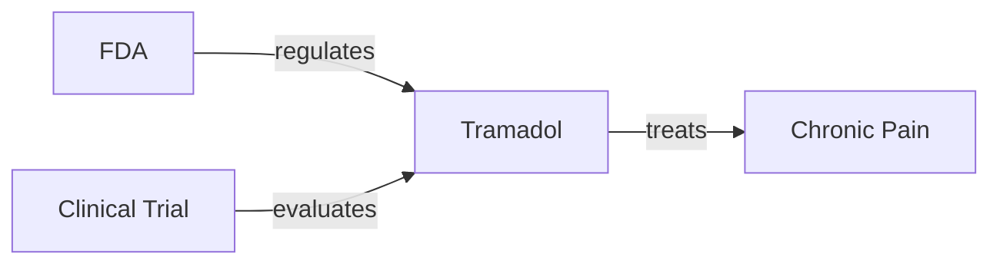

# DSPy Entity Extraction Assignment

## Structuring Unstructured Data with LLMs: DSPy Practical Assignment


Why This Matters


Unstructured data (text, PDFs, web content) makes up 80-90% of data, yet it’s unusable
for analysis without costly manual processing. LLMs solve this by acting as "structured
data compilers" – converting messy text into clean, queryable formats (entities, relations,
graphs). 

This assignment tests your ability to:
• Bridge theory and practice (real-world data ≠ textbook examples)
• Handle LLM uncertainty (confidence loops, error resilience)
• Build production-ready pipelines (not just one-off scripts)


The provided DSPy codebase demonstrates exactly what modern data engineering
teams need:
1. Entity extraction → Turning text into typed objects (e.g., "pelletized frass" → Drug)
2. Intelligent deduplication → Solving real-world noise (e.g., "PB IC", "pea-barley
intercrop", "pea-barley intercrops" → 1 entity)
3. Knowledge graph generation → Creating visual, queryable relationships (Mermaid
diagrams)


-------


The system processes 10 scientific URLs, extracts entities and relationships, and generates:


Scrape 10 URLs (provided below), process their text using the DSPy pipeline, and deliver:
1. 10 Mermaid diagrams (one per URL) visualizing key relationships.
2. A structured CSV with columns: link, tag, tag_type.
3. A Colab notebook showing your full implementation

--------


## Output Files

After running the notebook, you'll get:

```
├── tags.csv
├── mermaid_01.md
├── mermaid_02.md
├── mermaid_03.md
├── mermaid_04.md
├── mermaid_05.md
├── mermaid_06.md
├── mermaid_07.md
├── mermaid_08.md
├── mermaid_09.md
└── mermaid_10.md
```


------


### Entities (tags.csv)
```csv
entity_name,semantic_type
Tramadol,Drug
Chronic Pain,Medical Condition
Opioid,Drug Category
FDA,Organization
Clinical Trial,Research Method
```

### Mermaid Diagram Sample


------


## Processed URLs


"https://en.wikipedia.org/wiki/Sustainable_agriculture ",
"https://www.nature.com/articles/d41586-025-03353-5 ",
"https://www.sciencedirect.com/science/article/pii/S1043661820315152 ",
"https://www.ncbi.nlm.nih.gov/pmc/articles/PMC10457221/ ",
"https://www.fao.org/3/y4671e/y4671e06.htm ",
"https://www.medscape.com/viewarticle/time-reconsider-tramadol-chronic-pain-2025a1000ria ",
"https://www.sciencedirect.com/science/article/pii/S0378378220307088 ",
"https://www.frontiersin.org/news/2025/09/01/rectangle-telescope-finding-habitable-planets ",
"https://www.medscape.com/viewarticle/second-dose-boosts-shingles-protection-adults-aged-65-years-2025a1000ro7 ",
"https://www.theguardian.com/global-development/2025/oct/13/astro-ambassadors-stargazers-himalayas-hanle-ladakh-india ",


-------


 Just upload dspy_assignment.ipynb to Google Colab, add your API key, and execute all cells. 

 Or You can click on the Open in Colab button in dspy_assignment.ipynb to open it in ur Colab Notebook Env to run and test it.

 Thanks have a great time. :)
