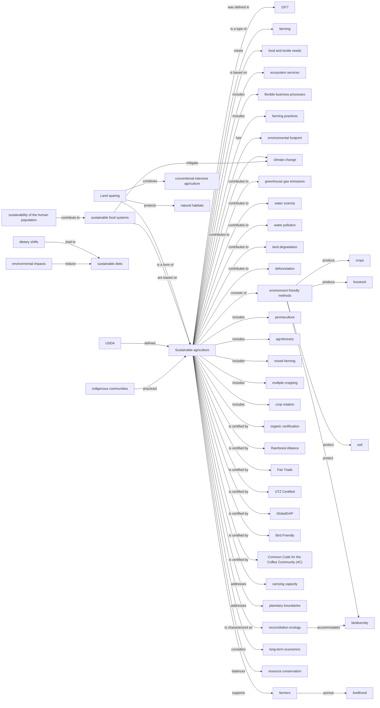

```mermaid
flowchart LR
    Sustainable_agriculture["Sustainable agriculture"] -->|is a type of| farming["farming"]
    Sustainable_agriculture["Sustainable agriculture"] -->|meets| food_and_textile_needs["food and textile needs"]
    Sustainable_agriculture["Sustainable agriculture"] -->|is based on| ecosystem_services["ecosystem services"]
    Sustainable_agriculture["Sustainable agriculture"] -->|includes| flexible_business_processes["flexible business processes"]
    Sustainable_agriculture["Sustainable agriculture"] -->|includes| farming_practices["farming practices"]
    Sustainable_agriculture["Sustainable agriculture"] -->|has| environmental_footprint["environmental footprint"]
    Sustainable_agriculture["Sustainable agriculture"] -->|contributes to| climate_change["climate change"]
    Sustainable_agriculture["Sustainable agriculture"] -->|contributes to| greenhouse_gas_emissions["greenhouse gas emissions"]
    Sustainable_agriculture["Sustainable agriculture"] -->|contributes to| water_scarcity["water scarcity"]
    Sustainable_agriculture["Sustainable agriculture"] -->|contributes to| water_pollution["water pollution"]
    Sustainable_agriculture["Sustainable agriculture"] -->|contributes to| land_degradation["land degradation"]
    Sustainable_agriculture["Sustainable agriculture"] -->|contributes to| deforestation["deforestation"]
    Sustainable_agriculture["Sustainable agriculture"] -->|consists of| environment_friendly_methods["environment friendly methods"]
    environment_friendly_methods["environment friendly methods"] -->|produce| crops["crops"]
    environment_friendly_methods["environment friendly methods"] -->|produce| livestock["livestock"]
    environment_friendly_methods["environment friendly methods"] -->|protect| soil["soil"]
    environment_friendly_methods["environment friendly methods"] -->|protect| biodiversity["biodiversity"]
    Sustainable_agriculture["Sustainable agriculture"] -->|includes| permaculture["permaculture"]
    Sustainable_agriculture["Sustainable agriculture"] -->|includes| agroforestry["agroforestry"]
    Sustainable_agriculture["Sustainable agriculture"] -->|includes| mixed_farming["mixed farming"]
    Sustainable_agriculture["Sustainable agriculture"] -->|includes| multiple_cropping["multiple cropping"]
    Sustainable_agriculture["Sustainable agriculture"] -->|includes| crop_rotation["crop rotation"]
    Land_sparing["Land sparing"] -->|is a form of| Sustainable_agriculture["Sustainable agriculture"]
    Land_sparing["Land sparing"] -->|combines| conventional_intensive_agriculture["conventional intensive agriculture"]
    Land_sparing["Land sparing"] -->|protects| natural_habitats["natural habitats"]
    sustainable_food_systems["sustainable food systems"] -->|are based on| Sustainable_agriculture["Sustainable agriculture"]
    sustainability_of_the_human_population["sustainability of the human population"] -->|contribute to| sustainable_food_systems["sustainable food systems"]
    sustainable_food_systems["sustainable food systems"] -->|mitigate| climate_change["climate change"]
    dietary_shifts["dietary shifts"] -->|lead to| sustainable_diets["sustainable diets"]
    environmental_impacts["environmental impacts"] -->|reduce| sustainable_diets["sustainable diets"]
    Sustainable_agriculture["Sustainable agriculture"] -->|is certified by| organic_certification["organic certification"]
    Sustainable_agriculture["Sustainable agriculture"] -->|is certified by| Rainforest_Alliance["Rainforest Alliance"]
    Sustainable_agriculture["Sustainable agriculture"] -->|is certified by| Fair_Trade["Fair Trade"]
    Sustainable_agriculture["Sustainable agriculture"] -->|is certified by| UTZ_Certified["UTZ Certified"]
    Sustainable_agriculture["Sustainable agriculture"] -->|is certified by| GlobalGAP["GlobalGAP"]
    Sustainable_agriculture["Sustainable agriculture"] -->|is certified by| Bird_Friendly["Bird Friendly"]
    Sustainable_agriculture["Sustainable agriculture"] -->|is certified by| Common_Code_for_the_Coffee_Community_4C["Common Code for the Coffee Community (4C)"]
    USDA["USDA"] -->|defined| Sustainable_agriculture["Sustainable agriculture"]
    Sustainable_agriculture["Sustainable agriculture"] -->|was defined in| 1977["1977"]
    indigenous_communities["indigenous communities"] -->|practiced| Sustainable_agriculture["Sustainable agriculture"]
    Sustainable_agriculture["Sustainable agriculture"] -->|addresses| carrying_capacity["carrying capacity"]
    Sustainable_agriculture["Sustainable agriculture"] -->|addresses| planetary_boundaries["planetary boundaries"]
    Sustainable_agriculture["Sustainable agriculture"] -->|is characterized as| reconciliation_ecology["reconciliation ecology"]
    reconciliation_ecology["reconciliation ecology"] -->|accommodates| biodiversity["biodiversity"]
    Sustainable_agriculture["Sustainable agriculture"] -->|considers| long_term_economics["long-term economics"]
    Sustainable_agriculture["Sustainable agriculture"] -->|balances| resource_conservation["resource conservation"]
    Sustainable_agriculture["Sustainable agriculture"] -->|supports| farmers["farmers"]
    farmers["farmers"] -->|pursue| livelihood["livelihood"]
```