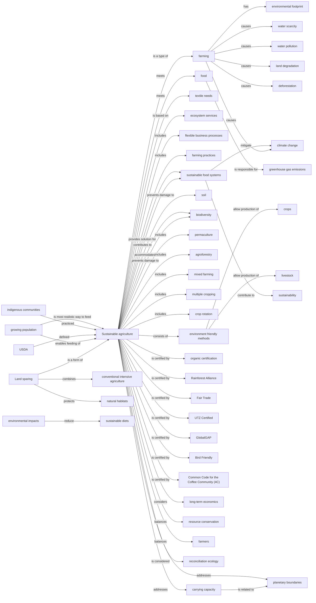

```mermaid
flowchart LR
 Sustainable_agriculture["Sustainable agriculture"] -->|is a type of| farming["farming"]
 Sustainable_agriculture["Sustainable agriculture"] -->|meets| food["food"]
 Sustainable_agriculture["Sustainable agriculture"] -->|meets| textile_needs["textile needs"]
 Sustainable_agriculture["Sustainable agriculture"] -->|is based on| ecosystem_services["ecosystem services"]
 Sustainable_agriculture["Sustainable agriculture"] -->|includes| flexible_business_processes["flexible business processes"]
 Sustainable_agriculture["Sustainable agriculture"] -->|includes| farming_practices["farming practices"]
 farming["farming"] -->|has| environmental_footprint["environmental footprint"]
 farming["farming"] -->|causes| climate_change["climate change"]
 food["food"] -->|is responsible for| greenhouse_gas_emissions["greenhouse gas emissions"]
 farming["farming"] -->|causes| water_scarcity["water scarcity"]
 farming["farming"] -->|causes| water_pollution["water pollution"]
 farming["farming"] -->|causes| land_degradation["land degradation"]
 farming["farming"] -->|causes| deforestation["deforestation"]
 Sustainable_agriculture["Sustainable agriculture"] -->|consists of| environment_friendly_methods["environment friendly methods"]
 environment_friendly_methods["environment friendly methods"] -->|allow production of| crops["crops"]
 environment_friendly_methods["environment friendly methods"] -->|allow production of| livestock["livestock"]
 Sustainable_agriculture["Sustainable agriculture"] -->|prevents damage to| soil["soil"]
 Sustainable_agriculture["Sustainable agriculture"] -->|prevents damage to| biodiversity["biodiversity"]
 Sustainable_agriculture["Sustainable agriculture"] -->|includes| permaculture["permaculture"]
 Sustainable_agriculture["Sustainable agriculture"] -->|includes| agroforestry["agroforestry"]
 Sustainable_agriculture["Sustainable agriculture"] -->|includes| mixed_farming["mixed farming"]
 Sustainable_agriculture["Sustainable agriculture"] -->|includes| multiple_cropping["multiple cropping"]
 Sustainable_agriculture["Sustainable agriculture"] -->|includes| crop_rotation["crop rotation"]
 Land_sparing["Land sparing"] -->|is a form of| Sustainable_agriculture["Sustainable agriculture"]
 Land_sparing["Land sparing"] -->|combines| conventional_intensive_agriculture["conventional intensive agriculture"]
 Land_sparing["Land sparing"] -->|protects| natural_habitats["natural habitats"]
 Sustainable_agriculture["Sustainable agriculture"] -->|contributes to| sustainable_food_systems["sustainable food systems"]
 sustainable_food_systems["sustainable food systems"] -->|contribute to| sustainability["sustainability"]
 Sustainable_agriculture["Sustainable agriculture"] -->|provides solution for| sustainable_food_systems["sustainable food systems"]
 growing_population["growing population"] -->|enables feeding of| Sustainable_agriculture["Sustainable agriculture"]
 sustainable_food_systems["sustainable food systems"] -->|mitigate| climate_change["climate change"]
 environmental_impacts["environmental impacts"] -->|reduce| sustainable_diets["sustainable diets"]
 Sustainable_agriculture["Sustainable agriculture"] -->|is certified by| organic_certification["organic certification"]
 Sustainable_agriculture["Sustainable agriculture"] -->|is certified by| Rainforest_Alliance["Rainforest Alliance"]
 Sustainable_agriculture["Sustainable agriculture"] -->|is certified by| Fair_Trade["Fair Trade"]
 Sustainable_agriculture["Sustainable agriculture"] -->|is certified by| UTZ_Certified["UTZ Certified"]
 Sustainable_agriculture["Sustainable agriculture"] -->|is certified by| GlobalGAP["GlobalGAP"]
 Sustainable_agriculture["Sustainable agriculture"] -->|is certified by| Bird_Friendly["Bird Friendly"]
 Sustainable_agriculture["Sustainable agriculture"] -->|is certified by| Common_Code_for_the_Coffee_Community_4C["Common Code for the Coffee Community (4C)"]
 USDA["USDA"] -->|defined| Sustainable_agriculture["Sustainable agriculture"]
 indigenous_communities["indigenous communities"] -->|practiced| Sustainable_agriculture["Sustainable agriculture"]
 growing_population["growing population"] -->|is most realistic way to feed| Sustainable_agriculture["Sustainable agriculture"]
 Sustainable_agriculture["Sustainable agriculture"] -->|considers| long_term_economics["long-term economics"]
 Sustainable_agriculture["Sustainable agriculture"] -->|balances| resource_conservation["resource conservation"]
 Sustainable_agriculture["Sustainable agriculture"] -->|balances| farmers["farmers"]
 Sustainable_agriculture["Sustainable agriculture"] -->|is considered| reconciliation_ecology["reconciliation ecology"]
 Sustainable_agriculture["Sustainable agriculture"] -->|accommodates| biodiversity["biodiversity"]
 carrying_capacity["carrying capacity"] -->|is related to| planetary_boundaries["planetary boundaries"]
 Sustainable_agriculture["Sustainable agriculture"] -->|addresses| carrying_capacity["carrying capacity"]
 Sustainable_agriculture["Sustainable agriculture"] -->|addresses| planetary_boundaries["planetary boundaries"]

```
