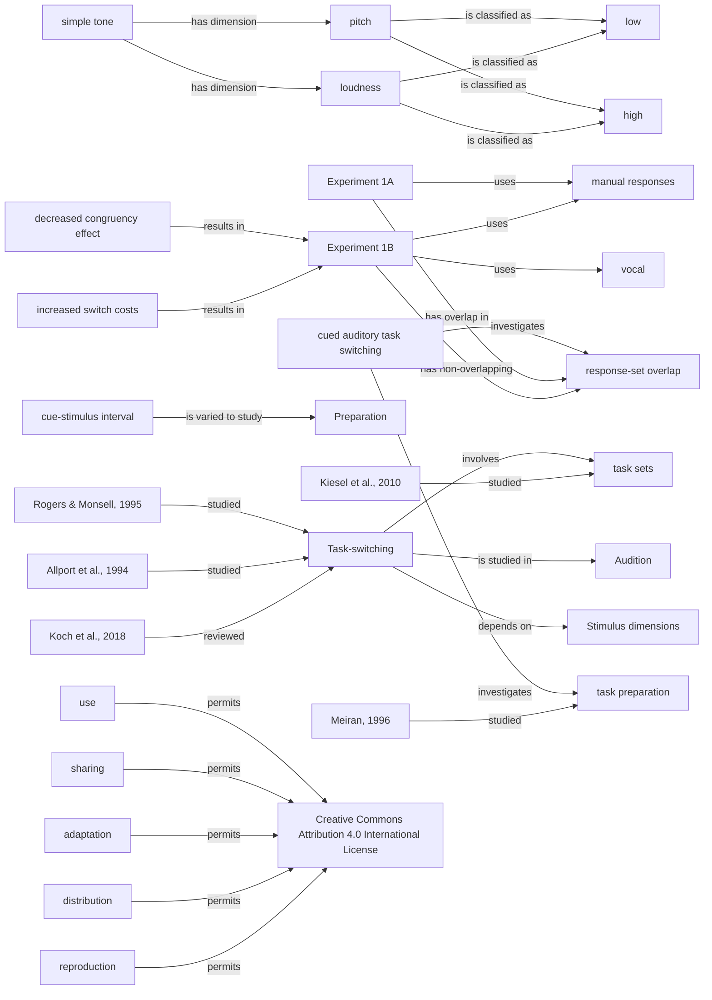

```mermaid
flowchart LR
    cued_auditory_task_switching["cued auditory task switching"] -->|investigates| task_preparation["task preparation"]
    cued_auditory_task_switching["cued auditory task switching"] -->|investigates| response_set_overlap["response-set overlap"]
    pitch["pitch"] -->|is classified as| low["low"]
    pitch["pitch"] -->|is classified as| high["high"]
    loudness["loudness"] -->|is classified as| low["low"]
    loudness["loudness"] -->|is classified as| high["high"]
    simple_tone["simple tone"] -->|has dimension| pitch["pitch"]
    simple_tone["simple tone"] -->|has dimension| loudness["loudness"]
    Experiment_1A["Experiment 1A"] -->|uses| manual_responses["manual responses"]
    Experiment_1A["Experiment 1A"] -->|has overlap in| response_set_overlap["response-set overlap"]
    Experiment_1B["Experiment 1B"] -->|uses| manual_responses["manual responses"]
    Experiment_1B["Experiment 1B"] -->|uses| vocal["vocal"]
    Experiment_1B["Experiment 1B"] -->|has non-overlapping| response_set_overlap["response-set overlap"]
    decreased_congruency_effect["decreased congruency effect"] -->|results in| Experiment_1B["Experiment 1B"]
    increased_switch_costs["increased switch costs"] -->|results in| Experiment_1B["Experiment 1B"]
    cue_stimulus_interval["cue-stimulus interval"] -->|is varied to study| Preparation["Preparation"]
    Task_switching["Task-switching"] -->|involves| task_sets["task sets"]
    Task_switching["Task-switching"] -->|is studied in| Audition["Audition"]
    Task_switching["Task-switching"] -->|depends on| Stimulus_dimensions["Stimulus dimensions"]
    Meiran,_1996["Meiran, 1996"] -->|studied| task_preparation["task preparation"]
    Rogers_&_Monsell,_1995["Rogers & Monsell, 1995"] -->|studied| Task_switching["Task-switching"]
    Allport_et_al.,_1994["Allport et al., 1994"] -->|studied| Task_switching["Task-switching"]
    Koch_et_al.,_2018["Koch et al., 2018"] -->|reviewed| Task_switching["Task-switching"]
    Kiesel_et_al.,_2010["Kiesel et al., 2010"] -->|studied| task_sets["task sets"]
    use["use"] -->|permits| Creative_Commons_Attribution_4.0_International_License["Creative Commons Attribution 4.0 International License"]
    sharing["sharing"] -->|permits| Creative_Commons_Attribution_4.0_International_License["Creative Commons Attribution 4.0 International License"]
    adaptation["adaptation"] -->|permits| Creative_Commons_Attribution_4.0_International_License["Creative Commons Attribution 4.0 International License"]
    distribution["distribution"] -->|permits| Creative_Commons_Attribution_4.0_International_License["Creative Commons Attribution 4.0 International License"]
    reproduction["reproduction"] -->|permits| Creative_Commons_Attribution_4.0_International_License["Creative Commons Attribution 4.0 International License"]
```