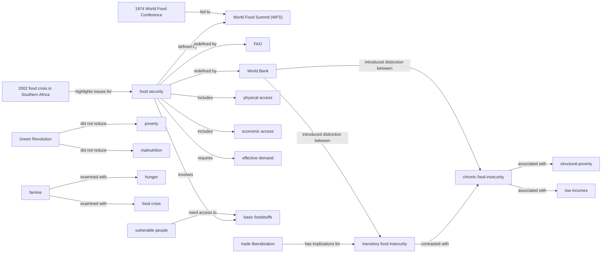

```mermaid
flowchart LR
    chronic_food_insecurity["chronic food insecurity"] -->|associated with| structural_poverty["structural poverty"]
    chronic_food_insecurity["chronic food insecurity"] -->|associated with| low_incomes["low incomes"]
    transitory_food_insecurity["transitory food insecurity"] -->|contrasted with| chronic_food_insecurity["chronic food insecurity"]
    food_security["food security"] -->|defined by| World_Food_Summit_WFS["World Food Summit (WFS)"]
    food_security["food security"] -->|redefined by| FAO["FAO"]
    food_security["food security"] -->|redefined by| World_Bank["World Bank"]
    food_security["food security"] -->|includes| physical_access["physical access"]
    food_security["food security"] -->|includes| economic_access["economic access"]
    food_security["food security"] -->|requires| effective_demand["effective demand"]
    food_security["food security"] -->|involves| basic_foodstuffs["basic foodstuffs"]
    1974_World_Food_Conference["1974 World Food Conference"] -->|led to| World_Food_Summit_WFS["World Food Summit (WFS)"]
    2002_food_crisis_in_Southern_Africa["2002 food crisis in Southern Africa"] -->|highlights issues for| food_security["food security"]
    Green_Revolution["Green Revolution"] -->|did not reduce| poverty["poverty"]
    Green_Revolution["Green Revolution"] -->|did not reduce| malnutrition["malnutrition"]
    famine["famine"] -->|examined with| hunger["hunger"]
    famine["famine"] -->|examined with| food_crisis["food crisis"]
    vulnerable_people["vulnerable people"] -->|need access to| basic_foodstuffs["basic foodstuffs"]
    trade_liberalization["trade liberalization"] -->|has implications for| transitory_food_insecurity["transitory food insecurity"]
    World_Bank["World Bank"] -->|introduced distinction between| chronic_food_insecurity["chronic food insecurity"]
    World_Bank["World Bank"] -->|introduced distinction between| transitory_food_insecurity["transitory food insecurity"]
```