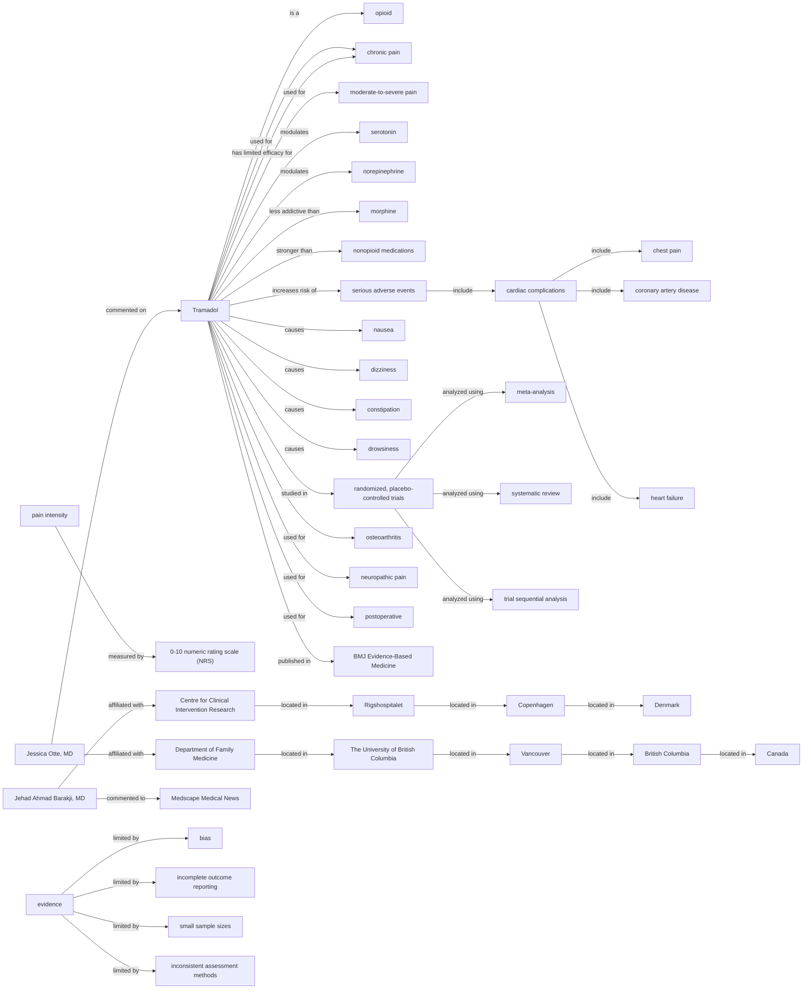

```mermaid
flowchart LR
    Tramadol["Tramadol"] -->|is a| opioid["opioid"]
    Tramadol["Tramadol"] -->|used for| chronic_pain["chronic pain"]
    Tramadol["Tramadol"] -->|used for| moderate_to_severe_pain["moderate-to-severe pain"]
    Tramadol["Tramadol"] -->|modulates| serotonin["serotonin"]
    Tramadol["Tramadol"] -->|modulates| norepinephrine["norepinephrine"]
    Tramadol["Tramadol"] -->|less addictive than| morphine["morphine"]
    Tramadol["Tramadol"] -->|stronger than| nonopioid_medications["nonopioid medications"]
    Tramadol["Tramadol"] -->|increases risk of| serious_adverse_events["serious adverse events"]
    serious_adverse_events["serious adverse events"] -->|include| cardiac_complications["cardiac complications"]
    cardiac_complications["cardiac complications"] -->|include| chest_pain["chest pain"]
    cardiac_complications["cardiac complications"] -->|include| coronary_artery_disease["coronary artery disease"]
    cardiac_complications["cardiac complications"] -->|include| heart_failure["heart failure"]
    Tramadol["Tramadol"] -->|causes| nausea["nausea"]
    Tramadol["Tramadol"] -->|causes| dizziness["dizziness"]
    Tramadol["Tramadol"] -->|causes| constipation["constipation"]
    Tramadol["Tramadol"] -->|causes| drowsiness["drowsiness"]
    Tramadol["Tramadol"] -->|studied in| randomized,_placebo_controlled_trials["randomized, placebo-controlled trials"]
    randomized,_placebo_controlled_trials["randomized, placebo-controlled trials"] -->|analyzed using| meta_analysis["meta-analysis"]
    randomized,_placebo_controlled_trials["randomized, placebo-controlled trials"] -->|analyzed using| systematic_review["systematic review"]
    randomized,_placebo_controlled_trials["randomized, placebo-controlled trials"] -->|analyzed using| trial_sequential_analysis["trial sequential analysis"]
    pain_intensity["pain intensity"] -->|measured by| 0_10_numeric_rating_scale_NRS["0-10 numeric rating scale (NRS)"]
    Tramadol["Tramadol"] -->|used for| osteoarthritis["osteoarthritis"]
    Tramadol["Tramadol"] -->|used for| neuropathic_pain["neuropathic pain"]
    Tramadol["Tramadol"] -->|used for| postoperative["postoperative"]
    Tramadol["Tramadol"] -->|has limited efficacy for| chronic_pain["chronic pain"]
    Tramadol["Tramadol"] -->|published in| BMJ_Evidence_Based_Medicine["BMJ Evidence-Based Medicine"]
    Jehad_Ahmad_Barakji,_MD["Jehad Ahmad Barakji, MD"] -->|affiliated with| Centre_for_Clinical_Intervention_Research["Centre for Clinical Intervention Research"]
    Centre_for_Clinical_Intervention_Research["Centre for Clinical Intervention Research"] -->|located in| Rigshospitalet["Rigshospitalet"]
    Rigshospitalet["Rigshospitalet"] -->|located in| Copenhagen["Copenhagen"]
    Copenhagen["Copenhagen"] -->|located in| Denmark["Denmark"]
    Jessica_Otte,_MD["Jessica Otte, MD"] -->|affiliated with| Department_of_Family_Medicine["Department of Family Medicine"]
    Department_of_Family_Medicine["Department of Family Medicine"] -->|located in| The_University_of_British_Columbia["The University of British Columbia"]
    The_University_of_British_Columbia["The University of British Columbia"] -->|located in| Vancouver["Vancouver"]
    Vancouver["Vancouver"] -->|located in| British_Columbia["British Columbia"]
    British_Columbia["British Columbia"] -->|located in| Canada["Canada"]
    Jehad_Ahmad_Barakji,_MD["Jehad Ahmad Barakji, MD"] -->|commented to| Medscape_Medical_News["Medscape Medical News"]
    Jessica_Otte,_MD["Jessica Otte, MD"] -->|commented on| Tramadol["Tramadol"]
    evidence["evidence"] -->|limited by| bias["bias"]
    evidence["evidence"] -->|limited by| incomplete_outcome_reporting["incomplete outcome reporting"]
    evidence["evidence"] -->|limited by| small_sample_sizes["small sample sizes"]
    evidence["evidence"] -->|limited by| inconsistent_assessment_methods["inconsistent assessment methods"]
```