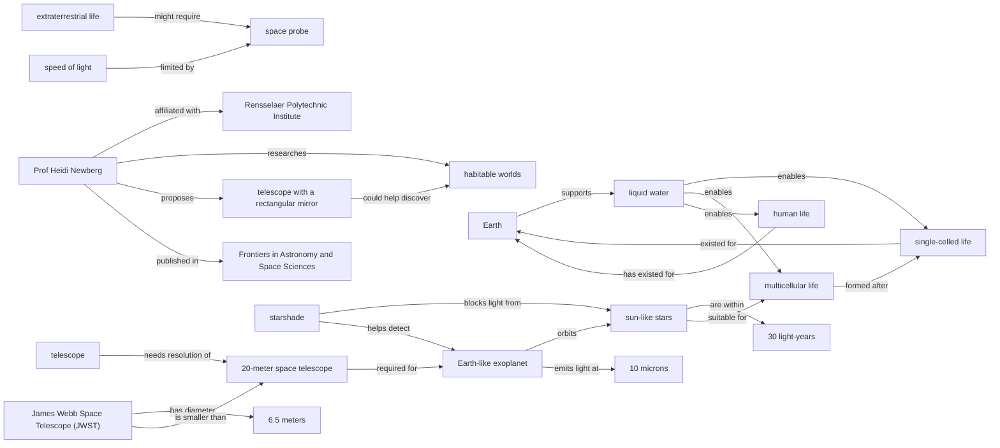

```mermaid
flowchart LR
    Prof_Heidi_Newberg["Prof Heidi Newberg"] -->|affiliated with| Rensselaer_Polytechnic_Institute["Rensselaer Polytechnic Institute"]
    Prof_Heidi_Newberg["Prof Heidi Newberg"] -->|researches| habitable_worlds["habitable worlds"]
    Prof_Heidi_Newberg["Prof Heidi Newberg"] -->|proposes| telescope_with_a_rectangular_mirror["telescope with a rectangular mirror"]
    telescope_with_a_rectangular_mirror["telescope with a rectangular mirror"] -->|could help discover| habitable_worlds["habitable worlds"]
    Earth["Earth"] -->|supports| liquid_water["liquid water"]
    liquid_water["liquid water"] -->|enables| single_celled_life["single-celled life"]
    liquid_water["liquid water"] -->|enables| multicellular_life["multicellular life"]
    liquid_water["liquid water"] -->|enables| human_life["human life"]
    single_celled_life["single-celled life"] -->|existed for| Earth["Earth"]
    multicellular_life["multicellular life"] -->|formed after| single_celled_life["single-celled life"]
    human_life["human life"] -->|has existed for| Earth["Earth"]
    extraterrestrial_life["extraterrestrial life"] -->|might require| space_probe["space probe"]
    speed_of_light["speed of light"] -->|limited by| space_probe["space probe"]
    sun_like_stars["sun-like stars"] -->|are within| 30_light_years["30 light-years"]
    sun_like_stars["sun-like stars"] -->|suitable for| multicellular_life["multicellular life"]
    Earth_like_exoplanet["Earth-like exoplanet"] -->|orbits| sun_like_stars["sun-like stars"]
    Earth_like_exoplanet["Earth-like exoplanet"] -->|emits light at| 10_microns["10 microns"]
    telescope["telescope"] -->|needs resolution of| 20_meter_space_telescope["20-meter space telescope"]
    20_meter_space_telescope["20-meter space telescope"] -->|required for| Earth_like_exoplanet["Earth-like exoplanet"]
    James_Webb_Space_Telescope_JWST["James Webb Space Telescope (JWST)"] -->|has diameter| 6.5_meters["6.5 meters"]
    James_Webb_Space_Telescope_JWST["James Webb Space Telescope (JWST)"] -->|is smaller than| 20_meter_space_telescope["20-meter space telescope"]
    starshade["starshade"] -->|blocks light from| sun_like_stars["sun-like stars"]
    starshade["starshade"] -->|helps detect| Earth_like_exoplanet["Earth-like exoplanet"]
    Prof_Heidi_Newberg["Prof Heidi Newberg"] -->|published in| Frontiers_in_Astronomy_and_Space_Sciences["Frontiers in Astronomy and Space Sciences"]
```