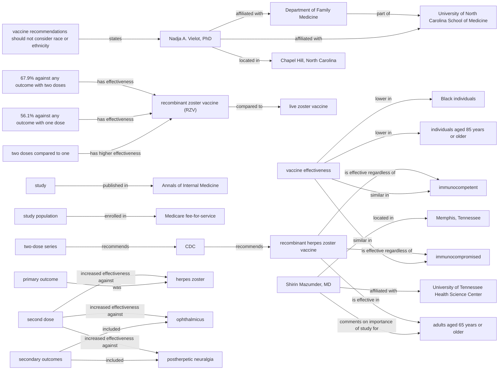

```mermaid
flowchart LR
    CDC["CDC"] -->|recommends| recombinant_herpes_zoster_vaccine["recombinant herpes zoster vaccine"]
    two_dose_series["two-dose series"] -->|recommends| CDC["CDC"]
    recombinant_herpes_zoster_vaccine["recombinant herpes zoster vaccine"] -->|is effective in| adults_aged_65_years_or_older["adults aged 65 years or older"]
    recombinant_herpes_zoster_vaccine["recombinant herpes zoster vaccine"] -->|is effective regardless of| immunocompromised["immunocompromised"]
    recombinant_herpes_zoster_vaccine["recombinant herpes zoster vaccine"] -->|is effective regardless of| immunocompetent["immunocompetent"]
    Nadja_A._Vielot,_PhD["Nadja A. Vielot, PhD"] -->|affiliated with| Department_of_Family_Medicine["Department of Family Medicine"]
    Department_of_Family_Medicine["Department of Family Medicine"] -->|part of| University_of_North_Carolina_School_of_Medicine["University of North Carolina School of Medicine"]
    Nadja_A._Vielot,_PhD["Nadja A. Vielot, PhD"] -->|affiliated with| University_of_North_Carolina_School_of_Medicine["University of North Carolina School of Medicine"]
    Nadja_A._Vielot,_PhD["Nadja A. Vielot, PhD"] -->|located in| Chapel_Hill,_North_Carolina["Chapel Hill, North Carolina"]
    study["study"] -->|published in| Annals_of_Internal_Medicine["Annals of Internal Medicine"]
    study_population["study population"] -->|enrolled in| Medicare_fee_for_service["Medicare fee-for-service"]
    67.9%_against_any_outcome_with_two_doses["67.9% against any outcome with two doses"] -->|has effectiveness| recombinant_zoster_vaccine_RZV["recombinant zoster vaccine (RZV)"]
    56.1%_against_any_outcome_with_one_dose["56.1% against any outcome with one dose"] -->|has effectiveness| recombinant_zoster_vaccine_RZV["recombinant zoster vaccine (RZV)"]
    recombinant_zoster_vaccine_RZV["recombinant zoster vaccine (RZV)"] -->|compared to| live_zoster_vaccine["live zoster vaccine"]
    two_doses_compared_to_one["two doses compared to one"] -->|has higher effectiveness| recombinant_zoster_vaccine_RZV["recombinant zoster vaccine (RZV)"]
    second_dose["second dose"] -->|increased effectiveness against| herpes_zoster["herpes zoster"]
    second_dose["second dose"] -->|increased effectiveness against| ophthalmicus["ophthalmicus"]
    second_dose["second dose"] -->|increased effectiveness against| postherpetic_neuralgia["postherpetic neuralgia"]
    vaccine_effectiveness["vaccine effectiveness"] -->|lower in| individuals_aged_85_years_or_older["individuals aged 85 years or older"]
    vaccine_effectiveness["vaccine effectiveness"] -->|similar in| immunocompromised["immunocompromised"]
    vaccine_effectiveness["vaccine effectiveness"] -->|similar in| immunocompetent["immunocompetent"]
    vaccine_effectiveness["vaccine effectiveness"] -->|lower in| Black_individuals["Black individuals"]
    vaccine_recommendations_should_not_consider_race_or_ethnicity["vaccine recommendations should not consider race or ethnicity"] -->|states| Nadja_A._Vielot,_PhD["Nadja A. Vielot, PhD"]
    Shirin_Mazumder,_MD["Shirin Mazumder, MD"] -->|affiliated with| University_of_Tennessee_Health_Science_Center["University of Tennessee Health Science Center"]
    Shirin_Mazumder,_MD["Shirin Mazumder, MD"] -->|located in| Memphis,_Tennessee["Memphis, Tennessee"]
    Shirin_Mazumder,_MD["Shirin Mazumder, MD"] -->|comments on importance of study for| adults_aged_65_years_or_older["adults aged 65 years or older"]
    primary_outcome["primary outcome"] -->|was| herpes_zoster["herpes zoster"]
    secondary_outcomes["secondary outcomes"] -->|included| ophthalmicus["ophthalmicus"]
    secondary_outcomes["secondary outcomes"] -->|included| postherpetic_neuralgia["postherpetic neuralgia"]
```