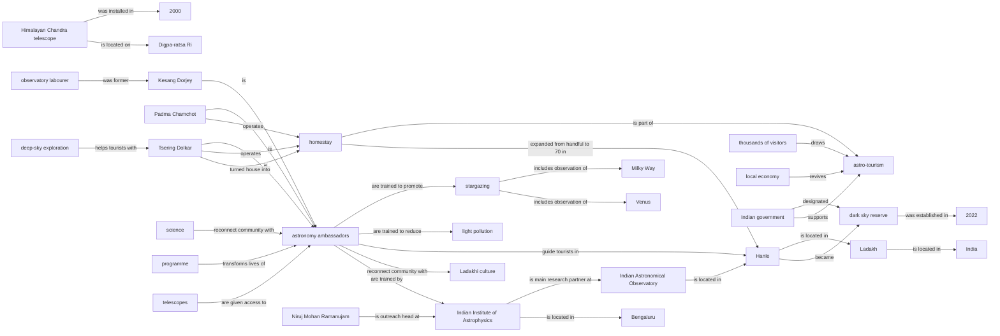

```mermaid
flowchart LR
    Hanle["Hanle"] -->|is located in| Ladakh["Ladakh"]
    Ladakh["Ladakh"] -->|is located in| India["India"]
    Hanle["Hanle"] -->|became| dark_sky_reserve["dark sky reserve"]
    dark_sky_reserve["dark sky reserve"] -->|was established in| 2022["2022"]
    Indian_Astronomical_Observatory["Indian Astronomical Observatory"] -->|is located in| Hanle["Hanle"]
    Indian_Institute_of_Astrophysics["Indian Institute of Astrophysics"] -->|is main research partner at| Indian_Astronomical_Observatory["Indian Astronomical Observatory"]
    Indian_Institute_of_Astrophysics["Indian Institute of Astrophysics"] -->|is located in| Bengaluru["Bengaluru"]
    Himalayan_Chandra_telescope["Himalayan Chandra telescope"] -->|was installed in| 2000["2000"]
    Himalayan_Chandra_telescope["Himalayan Chandra telescope"] -->|is located on| Digpa_ratsa_Ri["Digpa-ratsa Ri"]
    Tsering_Dolkar["Tsering Dolkar"] -->|is| astronomy_ambassadors["astronomy ambassadors"]
    Padma_Chamchot["Padma Chamchot"] -->|is| astronomy_ambassadors["astronomy ambassadors"]
    Kesang_Dorjey["Kesang Dorjey"] -->|is| astronomy_ambassadors["astronomy ambassadors"]
    astronomy_ambassadors["astronomy ambassadors"] -->|are trained to promote| stargazing["stargazing"]
    astronomy_ambassadors["astronomy ambassadors"] -->|are trained to reduce| light_pollution["light pollution"]
    astronomy_ambassadors["astronomy ambassadors"] -->|guide tourists in| Hanle["Hanle"]
    Tsering_Dolkar["Tsering Dolkar"] -->|operates| homestay["homestay"]
    Padma_Chamchot["Padma Chamchot"] -->|operates| homestay["homestay"]
    homestay["homestay"] -->|is part of| astro_tourism["astro-tourism"]
    thousands_of_visitors["thousands of visitors"] -->|draws| astro_tourism["astro-tourism"]
    local_economy["local economy"] -->|revives| astro_tourism["astro-tourism"]
    Indian_government["Indian government"] -->|designated| dark_sky_reserve["dark sky reserve"]
    Indian_government["Indian government"] -->|supports| astro_tourism["astro-tourism"]
    Niruj_Mohan_Ramanujam["Niruj Mohan Ramanujam"] -->|is outreach head at| Indian_Institute_of_Astrophysics["Indian Institute of Astrophysics"]
    stargazing["stargazing"] -->|includes observation of| Milky_Way["Milky Way"]
    stargazing["stargazing"] -->|includes observation of| Venus["Venus"]
    astronomy_ambassadors["astronomy ambassadors"] -->|reconnect community with| Ladakhi_culture["Ladakhi culture"]
    science["science"] -->|reconnect community with| astronomy_ambassadors["astronomy ambassadors"]
    programme["programme"] -->|transforms lives of| astronomy_ambassadors["astronomy ambassadors"]
    homestay["homestay"] -->|expanded from handful to 70 in| Hanle["Hanle"]
    Tsering_Dolkar["Tsering Dolkar"] -->|turned house into| homestay["homestay"]
    deep_sky_exploration["deep-sky exploration"] -->|helps tourists with| Tsering_Dolkar["Tsering Dolkar"]
    observatory_labourer["observatory labourer"] -->|was former| Kesang_Dorjey["Kesang Dorjey"]
    astronomy_ambassadors["astronomy ambassadors"] -->|are trained by| Indian_Institute_of_Astrophysics["Indian Institute of Astrophysics"]
    telescopes["telescopes"] -->|are given access to| astronomy_ambassadors["astronomy ambassadors"]
```